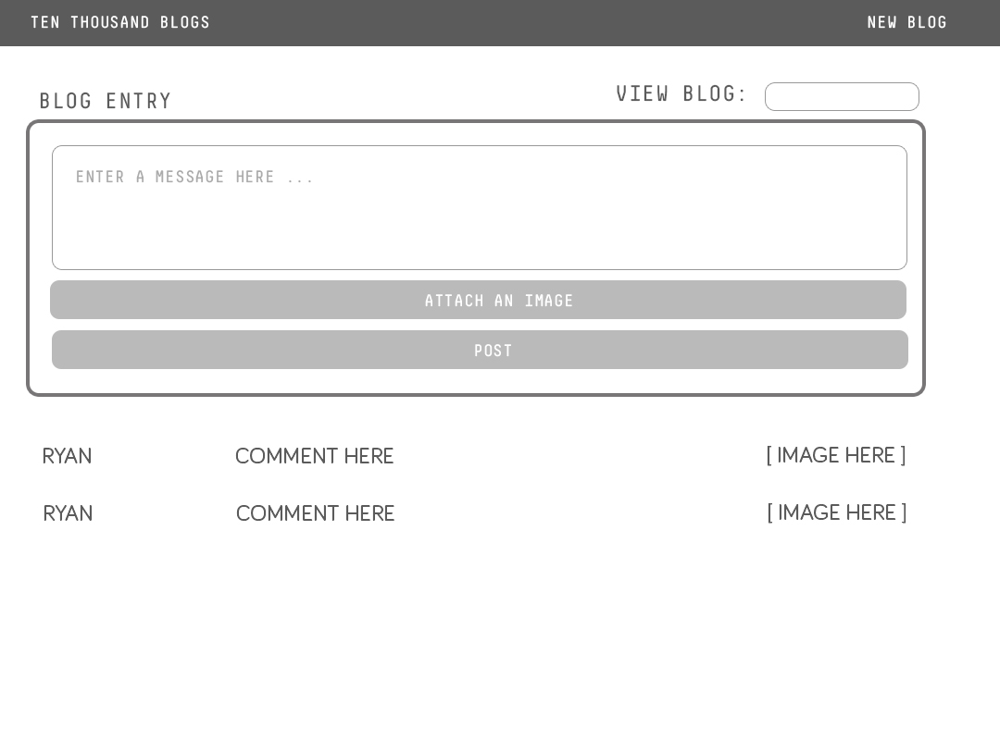

# TenThousandBlogs
 Engineering Onboarding at Ten Thousand Coffees

## Demo
For my engineering onboarding at Ten Thousand Coffees, TenThousandBlogs was developed with the following specifications:
- Support adding/deleting Entries to/from your Blog
- Support text up to 160 characters and an image per entry.
- Store any uploaded images in the mongodb.
- Support multiple Blogs that you are able to switch between.

## Design

## Run:
#### Running MongoDB:
- Command: `mongod` to run your database

#### Run Server:
- Command: `npm start` to start the server, then go to address `localhost:3000`

## References:
MEAN Tutorial:
https://www.djamware.com/post/5b00bb9180aca726dee1fd6d/mean-stack-angular-6-crud-web-application

Angular Tutorial: https://angular.io/tutorial

MongoDB Docs:
https://mongoosejs.com/docs/guide.html
